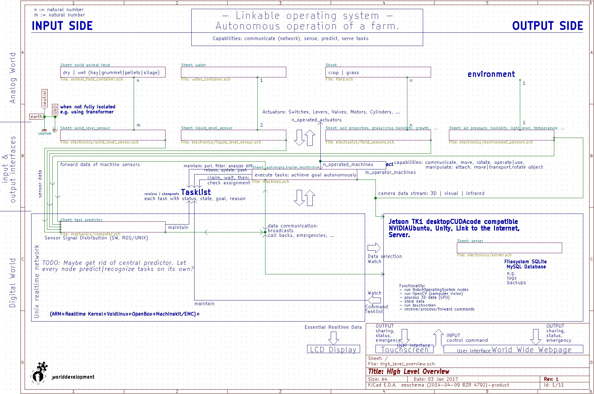

Linkable operating system (network)
===

<a href="http://github.com/worlddevelopment">worlddevelopment</a> real world operating system.

Operates systems to care for animals, farms, food, forests, roads, structures.

Other than an overview schematic this is a mere collection of required modules as all of worlddevelopment's pinned high level repositories.

High level overview
---

Dependencies
---
see <a href="local.xml">local.xml</a>

Related modules
---
see also <a href="http://wiki.opensourceecology.de/0install">0install</a>

* `network_communication`

Functions | capabilities
---

Such interoperability | collection entity is currently not available in the Virtual Time Machine unless it is converted to a conscious being that detects jobs (not organizes) centrally without commanding by merely maintaining a list of tasks, problems, e.g. empty reservoirs, prognoses and reactions to counteract negative / disadvantageous developments.

<a href="simulation/templates/task_detector/capabilities.xml">simulation/templates/task_detector/capabilities.xml</a>

+
all those actions inherited from assigned modules and their corresponding attached modules recursively if its command | organization | operation is known (e.g. dig, a capability of the digger).

Technologies used
---
(none) Difficult because knowledge for its operation is required which is pretty high level. Knowledge about construction is available in the corresponding used modules | dependencies.

Links
---
* Manual (not available)

